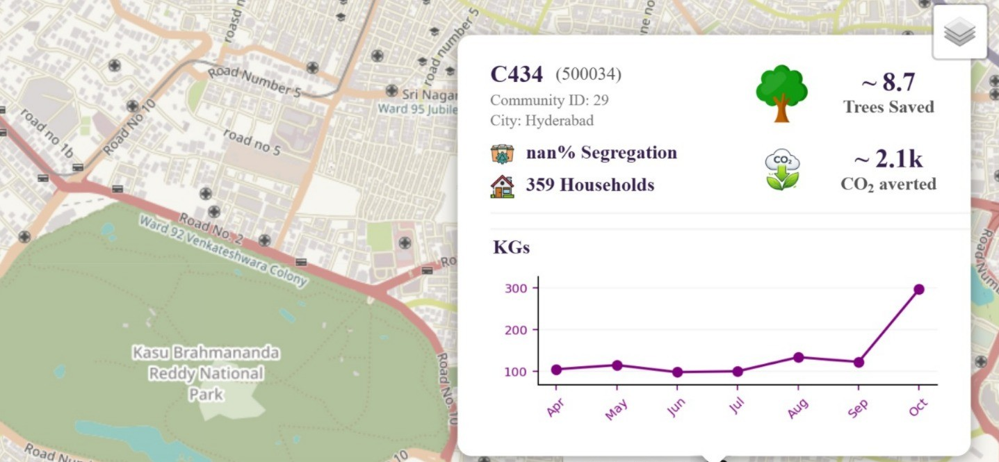

Spatial Analysis of Waste Generation & Participation

An interactive Streamlit dashboard that maps household waste generation and participation across cities, pincodes, and communities. Each community appears on a map, and clicking it opens a summary card with its key metrics and a monthly waste trend.

Features
Interactive geospatial maps built with Python and Folium, showing waste generation and participation by city, pincode, and coordinates
Community popups showing the community ID, pincode, city, number of households, segregation percentage, trees saved, CO₂ averted, and a month-by-month chart of waste collected (in KGs)
Behavioral segmentation that classifies pincodes into four categories based on waste and participation levels, to support targeted analysis and interventions
Data enrichment with external datasets such as pincode geolocation and population
Tech Stack
Area	Tools
App and UI	Streamlit
Mapping	Folium
Data processing	Pandas
Visualization	Matplotlib, Seaborn
Language	Python
Project Structure
streamlit-app-of-waste-analysis/
├── Finaldashboard.py    # Streamlit app (maps, popups, charts)
├── finaldataset.csv     # Cleaned and enriched dataset used by the app
├── requirements.txt     # Python dependencies
└── assests/             # Images used in the app and README
Getting Started
Clone the repository
bash
   git clone https://github.com/pmmeenakshi/streamlit-app-of-waste-analysis.git
   cd streamlit-app-of-waste-analysis
Install the dependencies
bash
   pip install -r requirements.txt
Run the app
bash
   streamlit run Finaldashboard.py

The app opens in your browser at http://localhost:8501.

Methodology
Cleaning: handled missing values and standardized fields with Pandas.
Enrichment: joined the waste data with pincode geolocation and population datasets.
Analysis: studied monthly trends and compared waste generation with participation using Matplotlib and Seaborn.
Segmentation: grouped pincodes into four behavioral categories based on waste and participation levels.
Visualization: plotted the results on interactive Folium maps with a popup for each community.
